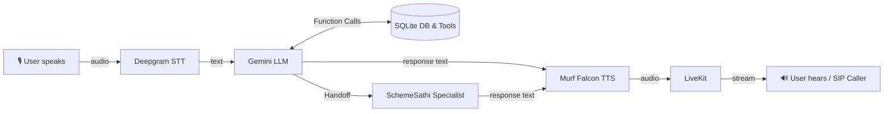

# FinSaathi — VoiceForBharat Edition (Day 1–10 Final)

FinSaathi (फिन साथी) is a friendly, warm, and highly knowledgeable digital financial voice assistant dedicated to helping people across India understand banking and financial services in their preferred language (Hindi, English, or Hinglish). 

Built as part of the "10 Days of Voice Agents — VoiceForBharat Edition" challenge, FinSaathi bridges the financial literacy gap by providing an accessible, voice-first interface to understand complex financial products, government schemes, and digital banking safety.

## Features & Capabilities

- **Multilingual Support**: Seamlessly converses in Hindi, English, and Hinglish.
- **Persistent User Memory**: Remembers returning users and their financial facts (with explicit consent).
- **Domain-Specific Tools**: Checks basic eligibility for government schemes like PMJJBY and PMSBY using official criteria.
- **Outbound SIP Calling**: Can initiate outbound phone calls (via SIP trunking) to remind users about scheme eligibility or financial follow-ups.
- **Human Escalation**: Can securely escalate complex or fraudulent issues to human agents with user consent.
- **Call Analytics**: Logs session outcomes, durations, and channels for analytics reporting.
- **Specialist Handoff**: Intelligently transfers complex government scheme inquiries to **SchemeSathi**, a dedicated specialist agent, seamlessly passing the conversation context.
- **Financial Safety Guardrails**: Strictly adheres to safety protocols. It will **never** request OTP, PIN, password, CVV, or full account/card numbers, and it will **never** guarantee financial outcomes or loan approvals.
- **Real-Time Voice Architecture**: Powered by LiveKit, Deepgram STT, Gemini LLM, and Murf Falcon TTS for ultra-low latency voice interactions.

## Architecture



## Setup & Environment Variables

### Prerequisites

- **Python** 3.10+
- **[uv](https://docs.astral.sh/uv/)** - fast Python package manager
- **Node.js** 18+
- **pnpm** — fast Node package manager
- A LiveKit project

### Environment Variables

Create `.env.local` in both `backend/` and `frontend/` (copy from `.env.example`). You need:

| Variable | Where to get it | Required |
| -------- | --------------- | -------- |
| `LIVEKIT_URL` | LiveKit Cloud dashboard | Yes |
| `LIVEKIT_API_KEY` | LiveKit Cloud dashboard | Yes |
| `LIVEKIT_API_SECRET` | LiveKit Cloud dashboard | Yes |
| `LIVEKIT_SIP_TRUNK_ID` | LiveKit SIP config (For Outbound Calling) | Yes |
| `MURF_API_KEY` | murf.ai/api/dashboard | Yes |
| `DEEPGRAM_API_KEY` | deepgram.com | Yes |
| `GOOGLE_API_KEY` | Google AI Studio | Yes |

### Installation

1. **Install backend dependencies:**
   ```bash
   cd backend
   uv sync
   uv run python src/agent.py download-files
   ```

2. **Install frontend dependencies:**
   ```bash
   cd frontend
   pnpm install
   ```

## Running the Application

**Option A - All-in-one (from repo root):**

```bash
# macOS/Linux
chmod +x start_app.sh
./start_app.sh

# Windows (PowerShell)
.\start_app.ps1
```

**Option B - Separate terminals:**

```bash
# Terminal 1 — LiveKit Server
livekit-server --dev

# Terminal 2 — Backend agent
cd backend && uv run python src/agent.py dev

# Terminal 3 — Frontend
cd frontend && pnpm dev
```

Then open **http://localhost:3000** in your browser.

## Day 1–10 Feature Progression

- **Day 1-3 (Foundation)**: Initialized the Voice AI agent using LiveKit, Murf Falcon TTS, Deepgram STT, and Gemini. Established the FinSaathi persona, Hindi/Hinglish capability, and strict financial safety guardrails.
- **Day 4 (Memory)**: Added a persistent SQLite database (`memory.db`) and tools to save and lookup user information across sessions with explicit consent.
- **Day 5 (Tools)**: Implemented `check_scheme_eligibility` tool using real domain rules for schemes like PMJJBY and PMSBY.
- **Day 6 (Outbound SIP)**: Added `outbound_call.py` to initiate SIP calls via LiveKit for financial scheme reminders with specialized outbound prompt injection.
- **Day 7 (Escalation)**: Created a `create_escalation` tool to handle suspected fraud or complex inquiries by escalating to human support with user consent.
- **Day 8 (Analytics)**: Added session-level analytics logging to `caller_data.db` to track call durations, success outcomes, and channels.
- **Day 9 (Specialist Handoff)**: Created the `SchemeSathi` specialist agent and a `handoff_to_scheme_specialist` tool. FinSaathi can smoothly transition complex scheme questions to the specialist while preserving the conversation context.
- **Day 10 (Final Polish)**: Testing, verification, and documentation updates.

## Testing & Verification

The project includes unit tests for the LLM behavior and Escalation Database.

Run backend tests:
```bash
cd backend
uv run pytest
```

Included tests:
- `test_llm.py`: Verifies FinSaathi strictly refuses to ask for sensitive information (OTP, PIN) and answers general financial questions correctly.
- `test_escalation_db.py`: Verifies the human escalation logic and SQLite database writes safely without storing sensitive data.

## Project Structure

```
murf-livekit-starter/
├── backend/                 # Python voice agent
│   ├── src/
│   │   ├── agent.py         # Main LiveKit agent entrypoint, pipelines, tools, analytics, handoffs
│   │   ├── prompt.py        # FinSaathi System Prompt & Guardrails
│   │   ├── scheme_specialist_prompt.py # SchemeSathi Specialist Prompt
│   │   ├── db.py            # SQLite implementations (Memory, Analytics, Escalation)
│   │   └── outbound_call.py # Outbound SIP calling script
│   ├── tests/               # Pytest test suite
│   └── ...
├── frontend/                # Next.js UI for voice sessions
│   ├── app/                 # Next.js App Router (Main UI, Analytics Dashboard)
│   ├── components/          # UI Components
│   └── ...
├── start_app.sh             # Start LiveKit + backend + frontend (macOS/Linux)
├── start_app.ps1            # Start LiveKit + backend + frontend (Windows)
└── README.md                # This file
```
